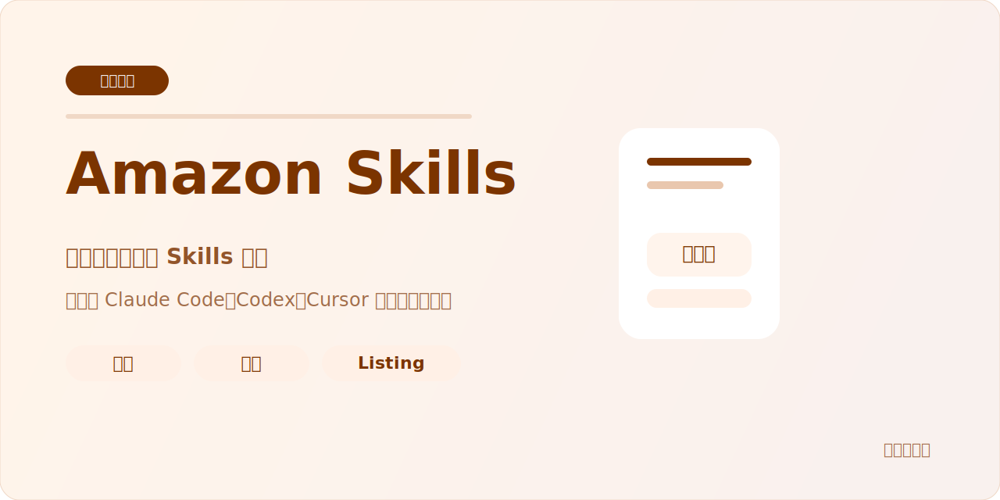

# Amazon Skills

> **作者**：Zach ｜ 公众号「Zach的进化笔记」
>
> Learn in public！把亚马逊卖家的实战经验做成可安装、可执行、可交付的 AI skill。



---

## 这个仓库是什么

一个面向亚马逊卖家的公开 skill 仓库。

这里放的是亚马逊业务相关的 skill，例如选品验证、Listing 健康检查、关键词与市场分析。  
这里不放品牌私有资料、真实店铺数据、领星服务器配置或内部工作成果。

## 当前状态

**Status: Ready to Push**

发布前固定流程见：
[docs/release-gate.md](./docs/release-gate.md)

---

## 推荐安装方式：让 AI 帮你装

推荐在以下 IDE 中直接用自然语言安装：

- Claude Code
- Codex
- Cursor

把下面这句话直接发给你的 AI：

```text
帮我安装 `zach-feature-demand-validator` 这个 skill，来源仓库是 `amazon-skills`。直接装到当前工作区，并把依赖一起检查好。
```

如果你要装 Listing 健康检查器，把 skill 名换成：

```text
zach-listing-health-checker
```

手动安装仍然保留，但只作为降级方案：
[docs/manual-install.md](./docs/manual-install.md)

---

## 当前 Skills

| Skill | 解决什么问题 | 数据源 | 状态 |
|---|---|---|---|
| [zach-product-research](./skills/zach-product-research/README.md) | 用 Sorftime 做选品分析，输出市场调研三件套与原始数据 | Sorftime MCP | Ready |
| [zach-feature-demand-validator](./skills/zach-feature-demand-validator/README.md) | 验证一个微创新功能到底是不是用户真实在意 | Sorftime + WebSearch 或本地评论包 | Ready |
| [zach-listing-health-checker](./skills/zach-listing-health-checker/README.md) | 用真实消费者视角巡检 Listing 健康状态 | Amazon 网页抓取 | Ready |

---

## 仓库边界

这个仓库只接收：

- 亚马逊业务相关的公开 skill
- 可公开的参考资料、脚本和示例
- 不含真实店铺数据与私有品牌身份的工作流

这个仓库不接收：

- 领星 MCP、固定出口网关、服务器部署资料
- 私人品牌运营资料、内部知识库、飞书身份、令牌
- 工作成果、历史归档、真实业务报表

---

## 关于作者

关注「**Zach的进化笔记**」，获取 AI x 跨境电商的实战经验、工具和方法论：


扫码加入交流群，一起交流 AI + 跨境电商的实战玩法：


---

## License

MIT
